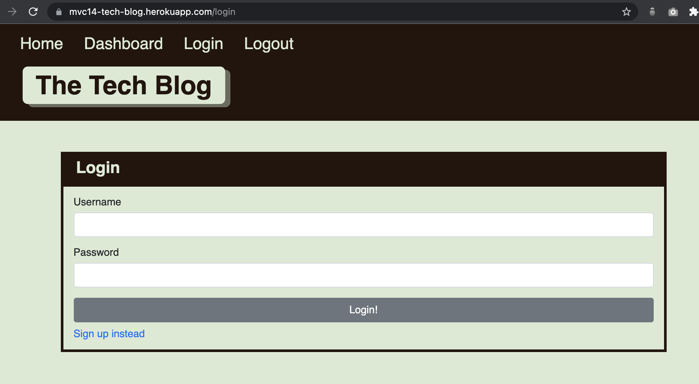

# Tech-Blog


## Description

In this project, my task is to build a CMS-style blog site similar to a Wordpress site, where developers can publish their blog posts and comment on other developers' posts as well.

## URL Link to GitHub Repository

https://github.com/jingwang6028/Tech-Blog

## URl link to deploy in Heroku

https://mvc14-tech-blog.herokuapp.com/

## Mock-Up Image



## Table of Contents

- [Requirements](#Requirements)
- [Installation](#installation)
- [License](#license)
- [Questions](#questions)

## Requirements

```
Node.js
npm
```

## Installation

1. To install employee database, change directory to db folder, and run the following command:

```
mysql -u root -p
```

2. To install necessary dependencies, run the following command in main folder:

```
npm i
```

## License

This project is licensed under the MIT license.

## Questions

If you have any questions about the repo, open an issue or contact me directly at jingwang6028@gmail.com. You can find more of my work at [jingwang6028](https://github.com/jingwang6028).
